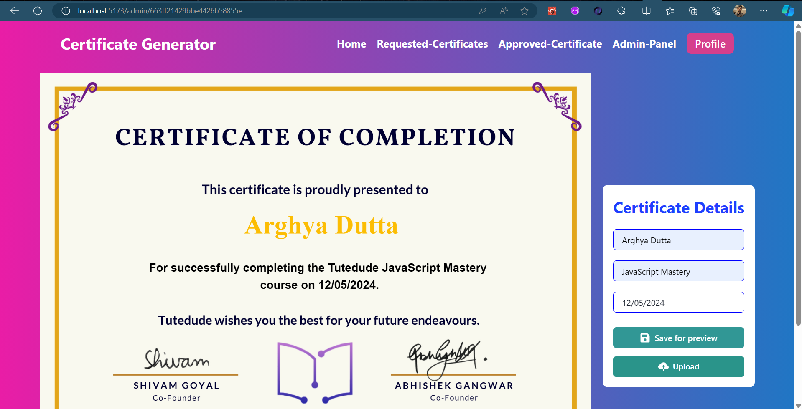

# Certificate-Generator Web-App

Certificate-Generator is a web application to generate certificates. It provides a seamless user experience with features such as user authentication, certificate request management, and storage.

## Features

- **User Authentication**: Users can sign in using their email and password.
- **Certificate Request**: Users can request certificates, available on site as per their choice.
- **Admin Panel**: Special users with admin roles can access the admin-panel to add new certificate templates, view certificate requests from other users and approve them.
- **Certificate Customize and Preview**: An admin edits the Certificate description, and downloads it in pdf format for preview after customizing.

## Tech Stacks

<a href="" target="_blank" rel="noreferrer">  </a>
<a href="" target="_blank" rel="noreferrer">  </a>
<a href="" target="_blank" rel="noreferrer">  </a>
<a href="" target="_blank" rel="noreferrer">  </a>
<a href="" target="_blank" rel="noreferrer">  </a>
<a href="" target="_blank" rel="noreferrer">  </a>
<a href="" target="_blank" rel="noreferrer">  </a>


## Web-App working demo video

Uploading Certificate Generator - Made with Clipchamp.mp4…


## UI of the Web-App

<p align='center'>
<!--  -->
<!--  -->
<!-- <p> -->
<!-- <p align='center'> -->
<!--  -->
<!--  -->
<!--  -->
<!-- <p> -->


## Getting Started

To run this project locally, follow these steps:

1. **Clone the repository:**

    ```bash
    git clone https://github.com/arghyadutta080/Certificate-Generator.git
    cd Chatbot
    ```
2. **Open the `Certifcate-Generator` directory in your Code-Editor (In my case it's VS-Code)**

3. **Open the terminal in your Code-Editor and split it into two terminals**
   
3. **In the first terminal move to the server directory:**
   
    ```bash
    cd server
    ```
    
4. **Install dependencies:**
   
    ```bash
    npm install
    ```
    
5. **Create a `.env` file at the root of the `server` directory with the following content:**
   
    ```env
    PORT=5001
    MONGODB_URL=<your-mongodb-url>
    JWT_SECRET=7bVNPzUERvtDx5C
    ```

6. **Run the `server`:**

    ```bash
    npm run start
    ```

7. **In the second terminal move to the `client` directory:**

    ```bash
    cd client
    ```

8. **Install dependencies:**

    ```bash
    npm install
    ```

9. **Create a new Firebase Project with [Firebase Console](https://console.firebase.google.com) and collect Project Configuration.**

10. **Create a `.env` file at the root of `client` directory with the following content:**

    ```env
    VITE_API_KEY=your-api-key
    VITE_AUTH_DOMAIN=your-auth-domain
    VITE_PROJECT_ID=your-project-id
    VITE_STORAGE_BUCKET=your-storage-bucket
    VITE_MESSAGING_SENDER_ID=your-messaging-sender-id
    VITE_APP_ID=your-app-id
    VITE_MEASUREMENT_ID=your-measurement-id

    VITE_SERVER_API=http://localhost:5001

    VITE_CLOUDINARY_CLOUD_NAME=your-cloud-name
    VITE_CLOUDINARY_UPLOAD_PRESET=your-upload-preset
    VITE_CLOUDINARY_API=your-cloudinary-api
    ```

11. **Run the `client`:**

    ```bash
    npm run dev
    ```

12. **Now, You will be redirected to [localhost:5173](http://localhost:5173)**


## Contributing

Contributions to the project are welcome! To contribute, fork the repository and create a new branch for your changes. Once you have made your changes, create a pull request to merge your branch into the main repository.

